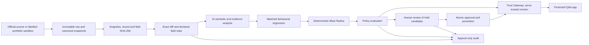

# Istithbat | استثبات

Integrity and release governance for organizations consuming Islamic knowledge in AI and digital products. Istithbat detects upstream changes, preserves exact evidence, tests their behavioral effects, and keeps unreviewed candidates from silently reaching a protected app.

**AI advises. Policy governs. Humans decide.** Hashes prove that content changed; they do not determine religious truth, hadith authenticity or a fatwa.

- **Product:** [istithbat.vercel.app/overview](https://istithbat.vercel.app/overview)
- **Controlled upstream simulator:** [istithbat.vercel.app/sandbox](https://istithbat.vercel.app/sandbox)
- **Public repository:** [abdulwahiddev/Istithbat](https://github.com/abdulwahiddev/Istithbat)
- **Evidence:** [technical evidence](docs/technical-evidence.md), [evaluation](docs/evaluation.md), [source register](docs/data-sources.md)

## How it works



| Responsibility | What it does |
| --- | --- |
| Deterministic integrity | Preserves raw responses; canonicalizes and hashes snapshots, records and fields; records exact changes, equivalence flags and version identity. |
| AI | Explains semantic/evidence significance, generates targeted questions and advises on matched old/new answers. Structured output is schema-validated. It never establishes religious truth or grants trust. |
| Behavioral regression | Same provider, model, prompt, settings, question and retrieval configuration; only the knowledge version changes. Persisted configuration hashes and answer evidence support inspection. |
| Blast Radius | Traverses persisted dependencies; distinguishes EXPOSED, STALE and regression-confirmed IMPACTED assets. |
| Policy | Applies a deterministic rule floor. AI advice may only raise the action. REVIEW/QUARANTINE never release a candidate. Only POL-005 ALLOW for equivalent/operational changes can promote automatically. |
| Human and gateway | Sensitive held changes require a human decision. Approval promotes atomically; the gateway otherwise retains the served trusted version. Latest seen, trusted and served are separate states. |
| Audit | Records ingestion, pipeline attempts, policy, review and release actions; database guards enforce append-only history. |

## The demo

The sandbox is fictional, including its Arabic test sentence, evaluator and reference. It is not real hadith data and is not attributed to the Prophet ﷺ or a real provider.

The controlled scenario starts with trusted/served **v13**, then publishes the existing **v14** fixture: the synthetic `judgment` changes from `إسناده صحيح` to `صحيح`. One publish sends a signed webhook; Istithbat fetches the upstream source, snapshots/hashes/diffs it, runs analysis/regression/Blast Radius/policy, and holds the candidate under POL-002. The protected app keeps serving v13 until an authorized human approves a release.

The current held demo can be inspected without changing it. Demo Control and Reviewer sessions are separate. Credentials are supplied privately by the project owner, never in this repository. **Reset clears the sandbox investigation; do not reset or publish on shared Production without the owner's authorization.** See [console operation and recovery](docs/sandbox-demo.md).

## Real sources and measured scope

| Source | Production demo corpus | Separate full-corpus validation, 6 October 2026 |
| --- | --- | --- |
| [HadeethEnc](https://hadeethenc.com/) | 3 Arabic hadith entries with their English responses | 3,574 unique Arabic records and 2,328 available English translations; complete documented Arabic root-category union for these languages |
| [QuranEnc](https://quranenc.com/) | 11 ayat, surahs 1 and 112, selected `english_saheeh` translation; publisher metadata identifies Noor International Center | 114 surahs / 6,236 ayat of that translation |
| Synthetic sandbox | One controlled record per version | Separate independently authored synthetic test cases; no real-source text is mutated |

Both real APIs are read-only. Raw, canonical, record and field hashes were identical across two independent full-corpus passes. **These are private validation artifacts, not a full-corpus Production import or trust approval.** See the [measured report](evaluation/results/2026-10-06-real-corpus.md), [reproducible command](evaluation/corpus/README.md) and [provider terms/attribution](docs/data-sources.md).

## AI disclosure and limitations

Main implements **Gemini, OpenAI and Anthropic** adapters, with explicit live, mock and replay modes. The official complete 40-case evaluation and the persisted held Production comparisons used **Gemini `gemini-3.5-flash-lite`**. Persisted per-call metadata is the evidence for the model actually used; deployment defaults can change. [AI and safety disclosure](docs/ai-and-safety.md) explains schema validation, matched conditions and failure behavior.

The official synthetic evaluation measured **90.0% classification accuracy**, **89.5% material recall**, **0/21 false HIGH/CRITICAL classifications** and **57.5% regression detection accuracy**. These advisory model limitations are disclosed; they are not a claim of religious correctness. Deterministic mutation/policy tests passed 40/40. See [denominators, safety review and failure details](docs/evaluation.md).

Current scope: one controlled protected app, a small real-source baseline, deterministic lexical retrieval and a bounded serverless pipeline. Demo authentication is not enterprise RBAC. Quotas/provider availability can fail; a step that fails twice may continue to POLICY for a fail-closed decision. Missing/failed AI evidence cannot silently release substantive content. No embeddings, broad production-corpus deployment or autonomous religious judgments are claimed.

## Run locally

Use **Node.js 22+** (Production uses Node 24), the pnpm version declared in `package.json`, and a separate development database/private Storage bucket. Do not point initialization commands at the shared demo database.

```sh
pnpm install --frozen-lockfile
cp .env.example .env.local
```

Fill the required server configuration in the ignored `.env.local`; select mock mode for credential-free AI development, or add the selected provider's key for live AI. A working local core loop still needs Postgres and private Storage. Required variable **names only**:

| Purpose | Variables |
| --- | --- |
| Database | `DATABASE_URL`; `DATABASE_URL_DIRECT` for migrations, or the configured database connection as fallback |
| Private snapshot Storage | `SUPABASE_URL`, `SNAPSHOT_BUCKET`, `SUPABASE_SECRET_KEY`; optional legacy fallback `SUPABASE_SERVICE_ROLE_KEY` |
| AI mode and live configuration | `AI_MODE`; `AI_PROVIDER`, `AI_MODEL` for live mode; one of `GEMINI_API_KEY`, `OPENAI_API_KEY`, `ANTHROPIC_API_KEY` |
| Separate demo privileges | `DEMO_CONTROL_SECRET`, `DEMO_WEBHOOK_SECRET`, `DEMO_REVIEW_USERNAME`, `DEMO_REVIEW_SECRET` |
| Application origin | `APP_BASE_URL` |
| Optional local replay recording | `AI_RECORD_REPLAY` |

Use independent strong demo secrets (at least 16 characters). Create the named snapshot bucket as private before seeding; privileged access stays server-side. Never add a `NEXT_PUBLIC_` credential. No source API key is needed for the implemented HadeethEnc/QuranEnc connectors.

Initialize **your development database only**. These commands explicitly load the ignored environment file; the seed writes a trusted synthetic v13 and its demo dependency graph:

```sh
node --env-file=.env.local --import tsx db/migrate.ts
node --env-file=.env.local --conditions=react-server --import tsx db/seed/index.ts
pnpm dev
```

Open local `/overview` and `/sandbox`. To register the optional real sources in a development database, use `db/seed/real-sources.ts` with the same environment loading; this creates no versions or trust. First observations and explicit audited real-baseline establishment are separate operator actions, not automatic trust. See the [source lifecycle](docs/data-sources.md).

```sh
pnpm test
pnpm typecheck
pnpm build
pnpm check:secrets
pnpm start
# Offline synthetic evaluation; no remote source requests:
pnpm eval --suite mutations --ai mock
# Optional read-only remote corpus validation, outside normal unit tests:
pnpm corpus:validate --source all --out private-data/corpus-runs/my-run
```

Standard tests do not fetch full remote corpora. Optional database integration tests are skipped unless explicitly enabled against a test database. Live evaluations consume provider quota and do not run as part of ordinary unit tests.

## Code and evidence map

| Area | Location |
| --- | --- |
| DB/schema/migrations | [`db/`](db/), [`lib/db/`](lib/db/) |
| Official connectors and raw evidence | [`lib/connectors/`](lib/connectors/), [`lib/ingestion/`](lib/ingestion/) |
| Hashes and exact diff | [`lib/hashing/`](lib/hashing/), [`lib/diff/`](lib/diff/) |
| AI adapters/prompts/schemas | [`lib/ai/`](lib/ai/), [`lib/analysis/`](lib/analysis/) |
| Matched regression and retrieval | [`lib/regression/`](lib/regression/) |
| Blast Radius | [`lib/blast-radius/`](lib/blast-radius/) |
| Policy, review, atomic release | [`lib/policy/`](lib/policy/), [`lib/governance/`](lib/governance/), [`lib/gateway/`](lib/gateway/) |
| Persisted orchestration and APIs | [`lib/pipeline/`](lib/pipeline/), [`app/api/`](app/api/) |
| Tests and reproducible benchmarks | [`tests/`](tests/), [`evaluation/`](evaluation/), [`technical evidence`](docs/technical-evidence.md) |

Stack: Next.js 15, React 19, TypeScript, Supabase Postgres/private Storage, postgres.js/Drizzle, Zod, React Flow, Vitest and Vercel. Claude and Codex assisted development; AI runtime behavior is separately disclosed above. [Third-party licences/services](docs/third-party-register.md) and [submission-readiness audit](docs/submission-readiness.md) record remaining obligations. This public repository does not yet declare a project-wide redistribution licence; third-party content retains its own terms.
