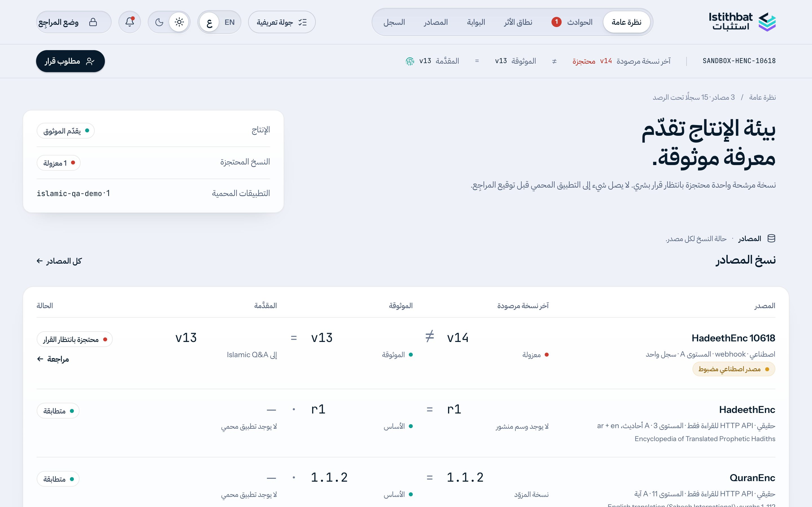
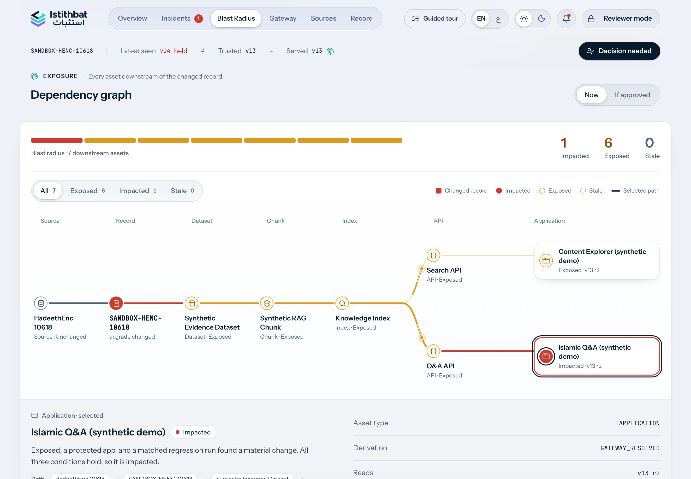

<p align="center">
  <picture>
    <source media="(prefers-color-scheme: dark)" srcset="public/brand/istithbat-symbol-on-dark.png" />
    
  </picture>
  <picture>
    <source media="(prefers-color-scheme: dark)" srcset="public/brand/istithbat-wordmark-on-dark.png" />
    
  </picture>
</p>

<h1 align="center">Know when trusted knowledge changes.</h1>

<p align="center"><strong>AI advises. Policy governs. Humans decide.</strong><br />
<a href="https://istithbat.vercel.app">Live app</a> · <a href="https://istithbat.vercel.app/sandbox">Sandbox demo</a> · <a href="https://youtu.be/DiOQbYYhkv4">Demo video</a></p>

## What Istithbat is

Istithbat is integrity infrastructure for Islamic knowledge consumed by AI and digital applications. It monitors upstream sources, preserves exact evidence of changes, tests how a change affects answers and dependent systems, and holds sensitive candidates for review.

An upstream update can alter what a protected application says without an explicit trust decision. Istithbat keeps those states separate: **Latest seen ≠ Trusted = Served** while a candidate is held. The source may change; the Trust Gateway continues serving the last trusted version.

Hashes establish *what changed*, not religious truth or hadith authenticity. AI investigates significance, deterministic policy sets the release floor, and a human decides whether a held candidate may be promoted.

## How it works

**CONNECT → DETECT → UNDERSTAND → TEST → TRACE → CONTAIN → HUMAN DECISION**


| Responsibility | What it does |
| --- | --- |
| Deterministic integrity | Preserves raw responses; canonicalizes and hashes snapshots, records and fields; records exact changes, equivalence flags and version identity. |
| AI | Explains semantic/evidence significance, generates targeted questions and advises on matched old/new answers. Structured output is schema-validated. It never establishes religious truth or grants trust. |
| Behavioral regression | Same provider, model, prompt, settings, question and retrieval configuration; only the knowledge version changes. Persisted configuration hashes and answer evidence support inspection. |
| Blast Radius | Traverses persisted dependencies; distinguishes EXPOSED, STALE and regression-confirmed IMPACTED assets. |
| Policy | Applies a deterministic rule floor. AI advice may only raise the action. REVIEW/QUARANTINE never release a candidate. Only POL-005 ALLOW for equivalent/operational changes can promote automatically. |
| Human and gateway | Sensitive held changes require a human decision. Approval promotes atomically; the gateway otherwise retains the served trusted version. Latest seen, trusted and served are separate states. |
| Audit | Records ingestion, pipeline attempts, policy, review and release actions; database guards enforce append-only history. |

## Bilingual experience

Switch between English and Arabic with the **EN / ع** control. Arabic mode uses native right-to-left layouts and IBM Plex Sans Arabic for the interface; Amiri distinguishes preserved Arabic source text from UI labels. Hashes, version labels, IDs, policy codes and URLs remain left-to-right. Source and religious Arabic, recorded AI evidence and technical identifiers are displayed as stored, without translating or rewriting the underlying evidence.



## Guided Tour and interactive Blast Radius

The optional **Guided Tour** is closed by default. Open it from the product header for seven stops: **Overview → Sandbox → Pipeline → Incident → Blast Radius → Preview Access → Gateway**. The sixth stop is labelled “Reviewer Preview” in the tour. Its compact **Demo Access** section shows only the intentionally public hackathon credentials below. Preview Access can inspect and preview decisions, but cannot sign, approve, promote or record one.

Blast Radius lets judges filter **All / Exposed / Impacted / Stale**, highlight a node and its persisted dependency path, and follow the same trace in a responsive mobile view. Filters change the display, not the underlying impact classification. The verified held incident remains **6 EXPOSED / 1 IMPACTED / 0 STALE**.



## Verified Production demo

The current [Production sandbox](https://istithbat.vercel.app/sandbox) uses **real HadeethEnc record 10618** as its source-derived baseline. Its Arabic hadith, English translation, attribution and references remain unchanged. Only Istithbat's controlled candidate changes `ar.grade`:

`صحيح دون قوله: (ولم يستدر)` → `صحيح` — four words removed; field-hash prefixes `449efbaf → d3908502`.

**Original record from HadeethEnc · candidate mutation created for demonstration.** HadeethEnc did **not** publish this candidate. The v13/v14 labels belong to Istithbat's sandbox. The unchanged English `grade_ar` retains the exception, so the field discrepancy remains visible.

The pre-submission verified Production run detected a `SCHOLAR_JUDGMENT` change, and deterministic **POL-002 quarantined v14**. Its three matched comparisons were **3 MATERIAL / 0 NON-MATERIAL**; Blast Radius found **6 EXPOSED / 1 IMPACTED / 0 STALE**. The impacted asset was the protected Islamic Q&A app. A fresh recovery rehearsal on 7 October returned **2 MATERIAL / 1 NON-MATERIAL** and the same POL-002 containment. Live model verdicts can vary; policy quarantine is deterministic. After a completed demo run, **Latest v14 is quarantined; Trusted and Served remain v13; no human decision is recorded**. Inspect the current state in [Incidents](https://istithbat.vercel.app/incidents), [sandbox](https://istithbat.vercel.app/sandbox), [local validation history](docs/source-derived-demo.md) and [console guide](docs/sandbox-demo.md).

## Judge access

These credentials are **intentionally public hackathon demo credentials**. They do not provide infrastructure, database, Vercel or real-source provider access. HadeethEnc and QuranEnc are never modified; the candidate is controlled sandbox test data. The earlier fully synthetic fixture remains in the repository for CI and historical evaluation, not the current Production incident.

### Demo Sandbox

Open [the sandbox console](https://istithbat.vercel.app/sandbox) and enter the **Demo Sandbox key:** `IstithbatDemo2026!`

This key unlocks only the controlled HadeethEnc 10618 sandbox reset and publish workflow. Reset replaces the current sandbox investigation, so judges should inspect the held incident before using it. The key cannot authorize source checks, arbitrary pipeline actions or human decisions.

### Preview Access (Reviewer Mode)

Open [Incidents](https://istithbat.vercel.app/incidents), select the current held incident, and sign in with:

- **Username:** `IslamicAIChallenge2026`
- **Password:** `IstithbatReviewer2026!`

This judge session can inspect evidence and preview Approve, Reject, Keep quarantined and Escalate. It cannot sign, approve, promote or record any decision. The real signer, administrator, webhook, database and AI provider credentials remain private. In the completed demo state, **Latest v14 is quarantined; Trusted and Served remain v13.**

## Post-submission polish

- Arabic / RTL product interface with an English / Arabic toggle.
- Optional seven-step Guided Tour and compact Demo Access.
- Interactive Blast Radius filters, path highlighting and mobile trace.
- Production-safe UI polish; integrity, policy, trust and demo data remain unchanged.

## Real sources and measured scope

| Source | Production demo corpus | Separate full-corpus validation, 6 October 2026 |
| --- | --- | --- |
| [HadeethEnc](https://hadeethenc.com/) | 3 Arabic hadith entries with their English responses | 3,574 unique Arabic records and 2,328 available English translations; complete documented Arabic root-category union for these languages |
| [QuranEnc](https://quranenc.com/) | 11 ayat, surahs 1 and 112, selected `english_saheeh` translation; publisher metadata identifies Noor International Center | 114 surahs / 6,236 ayat of that translation |
| Controlled sandbox | Source-derived HadeethEnc 10618 baseline and controlled candidate; one record per sandbox version | Separate synthetic evaluation cases; real provider endpoints remain untouched |

Both real APIs are read-only. Raw, canonical, record and field hashes were identical across two independent full-corpus passes. **These are private validation artifacts, not a full-corpus Production import or trust approval.** See the [measured report](evaluation/results/2026-10-06-real-corpus.md), [reproducible command](evaluation/corpus/README.md) and [provider terms/attribution](docs/data-sources.md).

## Validation and safety model

The final engineering suite passed **205 application tests**; eight optional database tests were skipped in the standard run. Typecheck, Production build and the repository secret check passed. The separate frozen 40-case evaluation tested deterministic mutation/policy behavior and measured advisory AI performance. Full-corpus validation checked source acquisition and repeat-fetch integrity; it did **not** ingest the entire corpus into Production or establish religious correctness. See [technical evidence](docs/technical-evidence.md) and [evaluation](docs/evaluation.md).

AI cannot grant `TRUSTED` or lower the deterministic policy floor. A substantive candidate remains held through REVIEW or QUARANTINE until an authorized human decision; only the deterministic POL-005 equivalent/operational path can allow automatic promotion. Failures stay visible and fail closed. Human approval uses an atomic release transaction; the audit trail is append-only.

## AI disclosure and limitations

Main implements **Gemini, OpenAI and Anthropic** adapters, with explicit live, mock and replay modes. The official complete 40-case evaluation and the current Production regression used **Gemini `gemini-3.5-flash-lite`**. Persisted per-call metadata is the evidence for the model actually used; deployment defaults can change. [AI and safety disclosure](docs/ai-and-safety.md) explains structured outputs, schema validation, matched conditions and failure behavior.

The official 40-case synthetic evaluation measured **90.0% analysis classification accuracy**, detected **17 of 19 expected material behavioral changes (89.5% material-change recall)**, and recorded **0/21 false HIGH/CRITICAL classifications**. The advisory regression comparator matched the expected material/non-material label in **23/40 cases (57.5% overall comparison accuracy)**, primarily because **15 expected non-material cases were flagged as material** in this benchmark. The 57.5% metric reflects one advisory AI component, **not Istithbat’s end-to-end integrity accuracy**, and these results do not establish religious correctness. Deterministic mutation and policy checks passed **40/40**; AI cannot grant trust or lower the policy floor.

> Given the three-day challenge window, the priority was fail-closed behavior, traceability, deterministic containment, and human review rather than tuning the comparator for precision. A production iteration would expand and balance the benchmark, refine the regression rubric and prompts, test stronger models, calibrate decision thresholds, add more domain-specific examples, and use human-reviewed cases to reduce false positives without sacrificing material-change recall.

See [denominators, safety review and failure details](docs/evaluation.md).

Current scope: one controlled protected app, a small real-source baseline, deterministic lexical retrieval and a bounded serverless pipeline. Demo authentication is not enterprise RBAC. Quotas/provider availability can fail; a step that fails twice may continue to POLICY for a fail-closed decision. Missing/failed AI evidence cannot silently release substantive content. No embeddings, broad production-corpus deployment or autonomous religious judgments are claimed.

## Run locally

Use **Node.js 22+** (Production uses Node 24), the pnpm version declared in `package.json`, and a separate development database/private Storage bucket. Do not point initialization commands at the shared demo database.

```sh
pnpm install --frozen-lockfile
cp .env.example .env.local
```

Fill the required server configuration in the ignored `.env.local`; select mock mode for credential-free AI development, or add the selected provider's key for live AI. A working local core loop still needs Postgres and private Storage. Required variable **names only**:

| Purpose | Variables |
| --- | --- |
| Database | `DATABASE_URL`; `DATABASE_URL_DIRECT` for migrations, or the configured database connection as fallback |
| Private snapshot Storage | `SUPABASE_URL`, `SNAPSHOT_BUCKET`, `SUPABASE_SECRET_KEY`; optional legacy fallback `SUPABASE_SERVICE_ROLE_KEY` |
| AI mode and live configuration | `AI_MODE`; `AI_PROVIDER`, `AI_MODEL` for live mode; one of `GEMINI_API_KEY`, `OPENAI_API_KEY`, `ANTHROPIC_API_KEY` |
| Separate demo privileges | `DEMO_CONTROL_SECRET`, `DEMO_WEBHOOK_SECRET`, `DEMO_REVIEW_USERNAME`, `DEMO_REVIEW_SECRET`, `DEMO_SANDBOX_SECRET`, `DEMO_REVIEW_PREVIEW_USERNAME`, `DEMO_REVIEW_PREVIEW_SECRET` |
| Application origin | `APP_BASE_URL` |
| Optional local replay recording | `AI_RECORD_REPLAY` |

Use independent strong demo secrets (at least 16 characters). Create the named snapshot bucket as private before seeding; privileged access stays server-side. Never add a `NEXT_PUBLIC_` credential. No source API key is needed for the implemented HadeethEnc/QuranEnc connectors.

Initialize **your development database only**. These commands explicitly load the ignored environment file; the seed writes a trusted synthetic v13 and its demo dependency graph:

```sh
node --env-file=.env.local --import tsx db/migrate.ts
node --env-file=.env.local --conditions=react-server --import tsx db/seed/index.ts
pnpm dev
```

Open local `/overview` and `/sandbox`. To register the optional real sources in a development database, use `db/seed/real-sources.ts` with the same environment loading; this creates no versions or trust. First observations and explicit audited real-baseline establishment are separate operator actions, not automatic trust. See the [source lifecycle](docs/data-sources.md).

```sh
pnpm test
pnpm typecheck
pnpm build
pnpm check:secrets
pnpm start
# Offline synthetic evaluation; no remote source requests:
pnpm eval --suite mutations --ai mock
# Optional read-only remote corpus validation, outside normal unit tests:
pnpm corpus:validate --source all --out "$CORPUS_OUTPUT_DIR"
```

Standard tests do not fetch full remote corpora. Optional database integration tests are skipped unless explicitly enabled against a test database. Live evaluations consume provider quota and do not run as part of ordinary unit tests.

## Code and evidence map

| Area | Location |
| --- | --- |
| DB/schema/migrations | [`db/`](db/), [`lib/db/`](lib/db/) |
| Official connectors and raw evidence | [`lib/connectors/`](lib/connectors/), [`lib/ingestion/`](lib/ingestion/) |
| Hashes and exact diff | [`lib/hashing/`](lib/hashing/), [`lib/diff/`](lib/diff/) |
| AI adapters/prompts/schemas | [`lib/ai/`](lib/ai/), [`lib/analysis/`](lib/analysis/) |
| Matched regression and retrieval | [`lib/regression/`](lib/regression/) |
| Blast Radius | [`lib/blast-radius/`](lib/blast-radius/) |
| Policy, review, atomic release | [`lib/policy/`](lib/policy/), [`lib/governance/`](lib/governance/), [`lib/gateway/`](lib/gateway/) |
| Persisted orchestration and APIs | [`lib/pipeline/`](lib/pipeline/), [`app/api/`](app/api/) |
| Tests and reproducible benchmarks | [`tests/`](tests/), [`evaluation/`](evaluation/), [`technical evidence`](docs/technical-evidence.md) |

Stack: Next.js 15, React 19, TypeScript, Supabase Postgres/private Storage, postgres.js/Drizzle, Zod, React Flow, Vitest and Vercel. Claude and Codex assisted development; AI runtime behavior is separately disclosed above. [Third-party licences/services](docs/third-party-register.md) and [submission-readiness audit](docs/submission-readiness.md) record remaining obligations. This public repository does not yet declare a project-wide redistribution licence; third-party content retains its own terms.
