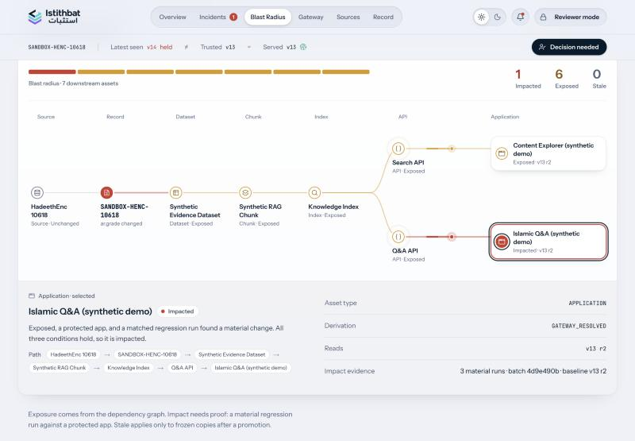
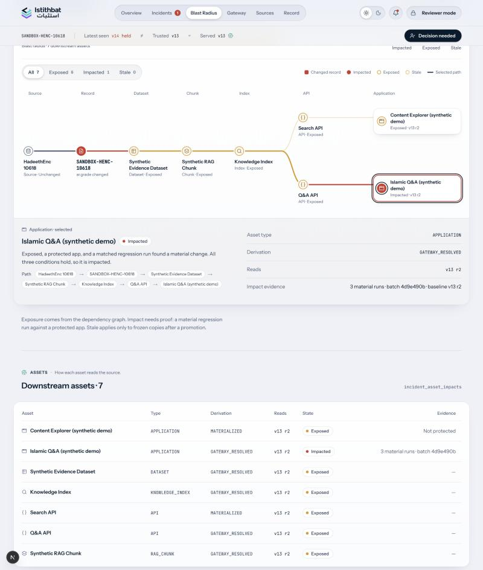
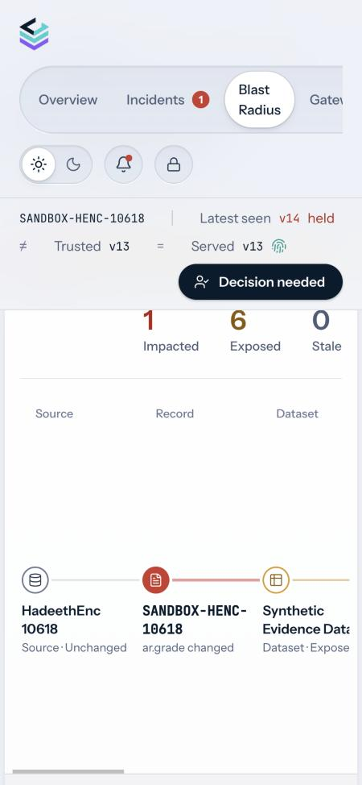
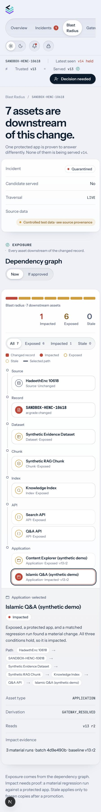

# Post-submission polish: before / after report

> **Historical QA record.** The branch/deployment status and earlier “Judge walkthrough” wording below describe the work before its final refinement and merge. The current Production product has an optional, closed-by-default **Guided Tour**, **Preview Access** and the Arabic / RTL interface documented in the [README](../../../README.md). The submitted baseline tag and backup branch remain preserved.

Branch `polish/post-submission`, based on the submitted `main` at `1abc2f8`.
That baseline is preserved as tag and branch `submitted-baseline-2026-10-06`. Production `dpl_2cUsTfB8P5FP2dmjS2MBBPuiNkzu` still serves it.
Nothing here is merged or deployed to Production.

## Scope and safety

- **Frontend only.** Every changed file is under `app/(ui)/`, `app/(sandbox)/` or `components/`. There are no changes to `lib/`, `db/`, API routes, contracts, auth, policy, the pipeline, seed data or the demo graph.
- **English output is unchanged.** I diffed the rendered text of Overview, Incidents, Incident Review, Blast Radius, Record, Gateway, Sources and Sandbox against Production. The only differences are the new controls (*Judge walkthrough*, *EN / ع*) and the Blast Radius filter, legend and mobile trace.
- **Source evidence is byte-identical.** The Arabic record text renders with the same 185 UTF-8 bytes in English and Arabic mode. Source text, hashes, versions, IDs, policy codes and recorded AI text are never translated.
- **Submitted evidence still holds:** 6 EXPOSED · 1 IMPACTED · 0 STALE · Islamic Q&A = IMPACTED · Latest v14 / Trusted v13 / Served v13.
- **No Production state was changed.** QA only read pages. I did not publish, reset, sign or approve anything.
- **Tests:** 205 passed, 8 skipped. Typecheck and the production build pass.

## 1. Blast Radius visual / UX

| Before | After |
|---|---|
|  |  |
|  |  |

- **Filters** (All 7 · Exposed 6 · Impacted 1 · Stale 0). A filter dims non-matching assets but never removes them. The table filters too, and empty states explain themselves; for example, Stale says it only applies after a promotion.
- **Path emphasis.** Hovering or focusing an asset previews its stored dependency paths. The selected asset keeps its path lit, and other edges step back.
- **Legend:** changed record, impacted, exposed, stale (dashed ring), selected path.
- **Visual distinction:** exposed is an open amber ring, impacted is solid coral, stale is a dashed hollow ring. Focus rings are now visible.
- **Mobile (under 720px):** the wide graph becomes a vertical trace (source → record → dataset → chunk → index → API → application). Islamic Q&A is visible without sideways scrolling.
- **Path animation:** the existing flow animation is kept and still turns off under `prefers-reduced-motion`.
- **Semantics unchanged.** It is the same persisted graph, the same `impact` values and the same D-07 "If approved" preview. Screenshots: `blast-after-desktop-impacted-filter.jpg`, `blast-after-desktop-stale-filter.jpg`.

## 2. Judge walkthrough

`judge-desktop-sandbox-step2.jpg` · `judge-desktop-gateway-open.jpg` · `judge-mobile-bar.jpg` · `judge-mobile-open.jpg`

- **Entry point:** a *Judge walkthrough* button in the header and in the sandbox bar.
- **Card:** a docked card that is shown collapsed on first visit. It can be expanded or dismissed; dismissal persists per browser in `localStorage`.
- **Seven stops:** Overview → Sandbox → Pipeline (`/overview#flow`) → Incident → Blast Radius → Reviewer Preview (`#decision`) → Gateway.
  - It has a current-step indicator, one line per stop and previous/next links. The last stop offers *Back to the start*, so there is no dead end.
- **Live state line:** the held/trusted/served labels come from the same incident list the header reads (currently *v14 quarantined · Trusted v13 · Served v13*).
- **Credentials:** only the two intentionally public credentials already published in the README are shown (the sandbox key and the review-preview login). Each is labelled public demo access / preview-only. The signer, control and webhook secrets never reach the browser.
- **Tested logged out:** I clicked through all seven steps, including dismissal and reopening.

## 3. Arabic / RTL

| Screen | Screenshot |
|---|---|
| Overview | `ar-overview-desktop.jpg` |
| Incident Review | `ar-incident-top-desktop.jpg`, `ar-incident-decision-desktop.jpg` (Reviewer Mode) |
| Blast Radius | `ar-blast-desktop.jpg`, `ar-blast-mobile-dark.jpg` |
| Gateway | `ar-gateway-desktop.jpg`, `ar-gateway-mobile-dark.jpg` |
| Sandbox | `ar-sandbox-desktop.jpg` |

**Screens changed:** shell (nav, state bar, reviewer dialog), Overview, Incidents, Incident Review (case summary, source, facts, AI advisory, regression, exposure, policy, Reviewer Mode), Blast Radius, Gateway, Sources, Record, Sandbox, the walkthrough, and the error and 404 pages.

**Translation files:** `components/strata/i18n/`

| File | Contents |
|---|---|
| `ar.ts` | About 1,060 Arabic UI labels, keyed by the exact English string. A missing key falls back to English. |
| `rules.ts` | 48 pattern rules for computed English sentences, such as headlines, audit narration and counts. Captured values like version labels and codes pass through verbatim. |
| `core.ts` | `makeT(locale)`; English is the identity function. |
| `client.tsx` | `LocaleRoot`, `useT`, `<Tx>` and the `EN · ع` switch. |

**How it works:**
- The language is a readable, non-privileged cookie (`istithbat_lang`), handled like the theme. The server renders the right direction on first paint, and English routes and behavior are unchanged.
- The `.s` root gets `lang="ar" dir="rtl"`.
- Diagrams use logical insets (`inset-inline-start`), and their SVG edge and flow layers mirror. In Arabic, the Blast Radius graph, Exposure track, policy gate and Trust Gateway read right to left: upstream on the right, the protected app on the left.
- `.mono` and `code` are LTR-isolated, so hashes, versions, IDs, URLs and codes such as `POL-002` keep their canonical form inside Arabic sentences.
- **Typography:** Amiri stays reserved for Arabic source text, so source and interface never look alike. Arabic UI labels use the platform's Arabic sans (SF Arabic, Segoe UI or Noto) through a `local()` face with `size-adjust`, limited to Arabic code points. No font is downloaded. Letter-spacing and uppercasing are removed in RTL because they break Arabic joining.
- **Kept in the original language:** recorded AI text (executive summary, domain analysis, regression answers and verdicts) is shown as recorded and marked *in its original language*. It is never machine-translated.

**Checked:** desktop and 375px mobile with no horizontal overflow (I fixed a 1px `.sr-only` overflow in RTL), mixed Arabic, English and hash content, and light and dark themes.

## 4. Multiple protected applications: proposal only (not implemented)

Adding graph nodes would change the submitted counts (6 / 1 / 0), so nothing was changed.

**Recommended shape, for after judging:**

| Synthetic consumer | Dependency path | Protected? | State | Why |
|---|---|---|---|---|
| Islamic Q&A (existing) | record → dataset → chunk → index → Q&A API → app | yes | **IMPACTED** | matched regression found a material change (unchanged) |
| Islamic Search (synthetic) | record → dataset → chunk → index → Search API → app | no | EXPOSED | depends on the record; no protection and no regression |
| Learning Assistant (synthetic) | record → dataset → chunk → index → Q&A API → app | yes | EXPOSED | protected, but no matched regression run, so it cannot be IMPACTED |
| Content API (synthetic) | record → dataset → Content API (MATERIALIZED) | no | EXPOSED, and STALE only *if approved* | frozen copy of v13; shows D-07 in the "If approved" view |

- **Resulting counts:** 9 EXPOSED · 1 IMPACTED · 0 STALE now, and 1 STALE in the "If approved" preview.
- **Labelling:** every new node would carry `(synthetic demo)` in its name, with `isDemoFixture`-style provenance.
- **Owner:** Codex. This needs a seed/demo-graph change (`db/` and the demo fixtures), a fresh regression batch only if a second app should ever be IMPACTED, and an update to the deck, video and README counts.
- **No frontend work needed.** Blast Radius already folds long columns and filters by state, and the mobile trace handles extra apps.

## 5. Final refinement pass

Screenshots are in `refined/`.

| What | File |
|---|---|
| Arabic Incidents | `ar-incidents-1440.jpg`, with the English baseline in `en-incidents-production-baseline-1440.jpg` |
| Arabic Incident Review | `ar-incident-review-tour-collapsed-1440.jpg`, `ar-mobile-incident-review-375.jpg` |
| Arabic Blast Radius | `ar-blast-radius-1280.jpg` |
| Arabic Gateway | `ar-gateway-1440.jpg` |
| Tour, collapsed | `en-tour-collapsed-1440.jpg`, `ar-mobile-overview-tour-collapsed-375.jpg` |
| Tour, expanded | `en-tour-all-steps-expanded-1440.jpg`, `ar-tour-demo-access-expanded-1440.jpg` |

**Arabic hierarchy**
- The Arabic UI face's `size-adjust` drops from 118% to 110%.
- RTL gets its own display scale: page titles 38px / 1.32, section headings 21px / 1.45, the decision question 30px, mobile titles 28px.
- Body line-height is 1.75, and the page header is a little tighter.
- Chip padding mirrors in RTL, so the dot side keeps the tighter inset. Nav items get more room and never wrap mid-phrase.
- At 1280px the header stays on one row with no horizontal overflow at 1440, 1280 or 375px.

**Guided tour**
- The tour replaces the "Judge walkthrough" label and file; there is no mention of judges anywhere in the UI.
- It is a 312px card, about 246px tall, showing the step, a 7-segment progress bar, the title, one line, the live state, and Back / Next.
- "All steps" opens a compact two-column list of titles. "Demo access" folds the credentials away.
- The default experience is the normal app: the tour opens only from the header *Guided tour* button, which carries a small dot until it has been opened once. Close and reopen are kept.

**Demo access**
- It shows the sandbox key and the reviewer preview username and password, each with a copy button.
- Labels: sandbox key = *public hackathon demo access*; reviewer = *preview only, cannot sign, approve or record a decision*. No other credential appears.

**One intentional English copy change.** Three existing Reviewer Mode strings said "Judge preview". They now read "Preview access active / cannot record a reason or sign / cannot sign a decision".
